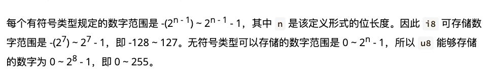

# 基本类型

> rust每个值都有确切的数据类型，
> 
> 基本类型 & 复合类型

## 基本类型: 最小化的原子类型，无法解构为其它类型

* 数值类型
  
  * 有符号整数（i8, i16, i32, i64, isize）
  
  * 无符号整数 (u8、u16, u32, u64, usize)
  
  * 浮点数 (f32, f64)
  
  * 有理数
  
  * 复数

* 字符串:  字符串字面量 & 字符串切片 **&str**

* 布尔类型 **true**&**false**

* 字符类型: 表示单个 Unicode 字符，存储为 `4 个字节`

* 单元类型：即 `()`, 其唯一的值也是 `()`

## 类型推导&标注

Rust 是 一门静态类型的语言， 也就是编译器必须再编译期知道我们所有变量的类型

Rust编译器可以推导出一些变量的类型，无法推导出来的需要手动标注

```rust
let guess = "42".parse().expect("Not a number!");


// 需要手动标注 如下
let guess:i32 = "42".parse().expect("Not a number!");
let guess = "42".parse::<i32>()
```

## 数值类型

### 整数类型 i(integer: 整数) u (unsigned: 无符号)

| 长度                     | 有符号类型 | 范围                                                      | 无符号类型 | 范围                                                      |
| ---------------------- | ----- | ------------------------------------------------------- | ----- | ------------------------------------------------------- |
| 8位                     | i8    | -128～127                                                | u8    | 0～255                                                   |
| 16 位                   | i16   |                                                         | u16   |                                                         |
| 32 位                   | i32   |                                                         | u32   |                                                         |
| 64 位                   | i64   |                                                         | u64   |                                                         |
| 128 位                  | i128  |                                                         | u128  |                                                         |
| 视架构而定（主要应用场景是租用做集合的索引） | isize | 若 CPU 是 32 位的，则这两个类型是 32 位的，同理，若 CPU 是 64 位，那么它们则是 64 位 | usize | 若 CPU 是 32 位的，则这两个类型是 32 位的，同理，若 CPU 是 64 位，那么它们则是 64 位 |

类型定义的形式统一为： `有无符号 + 类型大小(位数)`

无符号数只能取正数，有符号则表示数字即可以取正数又可以取负数



rust 默认使用 `i32` 

```rust
let i = 1; // i 就是 i32 类型的 性能最好
```

## 浮点类型

浮点类型就是带有小数点的数字

* f32

* f64 (默认浮点类型)

```rust
fn main() {
    let x = 2.0; // f64
    let y: f32 = 3.0; // f32
}
```

**浮点数陷阱**

* 避免在浮点数上测试相等性

* 当结果在数学上可能存在未定义时，需要格外的小心

```rust
fn main() {
    assert!(0.1 + 0.2 == 0.3)
}
```

程序会崩溃 `panic`


## NaN

`NaN`:数学上未定义的结果  is_nan判断是否是 nan 

```rust
fn main() {
    let x = (-42.0_f32).aqrt();
    assert_eq!(x, x);
    if x.is_nan() {
        println!("未定义的数学行为")
    }
}
```


## 位运算

| 运算符   | 说明                           |
| ----- | ---------------------------- |
| & 位与  | 相同位置均为1时则为1，否则为0             |
| \| 位或 | 相同位置只要有1时则为1，否则为0            |
| ^ 异或  | 相同位置不相同则为1，相同则为0             |
| ! 位非  | 把位中的0和1相互取反，即0置为1，1置为0       |
| << 左移 | 所有位向左移动指定位数，右位补0             |
| >> 右移 | 所有位向右移动指定位数，带符号移动（正数补0，负数补1） |

## 序列

生成连续的数值

1. `1..5` -> 1,2,3,4 不包括 5

2. `1..=5` -> 1,2,3,4 包括 5


## 字符、布尔、单元类型

字符：

* 字符只能用 `''`来 表示， `""` 是留给字符串的

* 占用4个字节

布尔: `true` `false` 一个字节

单元类型： `()`  

1. `main`函数就返回单元类型

2. `println!()`的返回值也是单元类型

3. 作为一个值用来占位 但是完全不占用任何内存


## 语句&表达式

语句会执行一些操作但是不会返回一个值

表达式会在求值后返回一个值（表达式总要返回值）

```rust
fn add_with_extra(x: i32, y: i32) {
    let x = x + 1; // 语句
    let y = y + 1; // 语句
    x + y; // 表达式
}
```

```rust
fn main() {
    let y = {
        let x = 3;
        x + 1
    }

    println!("The value of y is: {}", y);
}
```

⚠️  表达式不能包含分号，加上分号就会变成一个语句

表达式如果不返回任何值, 会隐式返回一个 `()`


## 函数

```rust
fn add(a: i32, b: i32) -> i32 {
    i + j
} 
```

1. 函数名和变量名使用 蛇形命名法，e.g. `fn add_two() -> {}`

2. 函数的位置可以随便放，不关心位置 只要有定义即可

3. 每个函数参数都需要标注类型


